# Tacit

Voice-authored, source-bound, versioned project knowledge for humans and coding agents.

## The problem

Code shows what a system does, but not why. The reasoning behind a rule, like "a job result can only be published while the worker still holds a valid lease", usually lives in someone's head, an old chat thread, or a PR comment nobody can find. New teammates have to ask around, and coding agents just guess from the code, which is how they confidently break rules nobody wrote down.

Tacit gives that reasoning a proper home. A maintainer explains intent out loud (or in text), Tacit ties it to the exact files and commit it's about, and after a human reviews and confirms it, it becomes versioned knowledge that learners and coding agents can query later. Agents can read it but never write it.

## The main ideas

- **Intent comes from a human.** A maintainer speaks or types an explanation. Nothing is published unless a person explicitly confirms it.
- **Knowledge is bound to source.** Every draft points at specific files in a specific pushed 40-character commit SHA, so it's always clear what code the knowledge was written about. Uncommitted local edits are recorded as hashes but never count as verified evidence.
- **Knowledge is immutable and versioned.** Publishing creates a new snapshot of the repository's knowledge. Old snapshots never change, history can be followed revision by revision, and a stale publication fails instead of overwriting newer work.
- **Reading is cheap and safe.** Learners and agents read a pinned snapshot read-only. Exact retrieval uses no speech or AI provider at all, so it costs nothing and gives the same answer every time.
- **When unsure, it abstains.** If the retrieved context is incomplete, stale or conflicting, Tacit says so instead of making something up.

## How it works end to end

1. **Teach.** A maintainer runs `teach` (text) or `teach-voice` (microphone) against a repo, a pushed commit and one or more files. Audio is captured locally, uploaded in durable chunks, and transcribed by Prisma. With `--live-transcript` you see provisional text while you speak. If an upload gets interrupted, the recording stays on disk and can be resumed.
2. **Draft.** Tacit creates a private draft containing the transcript (original evidence is always kept, even if you correct it), the source bindings, and a proposed statement of the rule. Optionally Evon can extract grounded candidate decisions and Timbre can read clarification questions aloud, but both are optional and the keys stay on the backend.
3. **Review.** The maintainer reads the draft, fixes the wording, answers any clarifying questions, and resolves ambiguity. A correction is a human edit layered on top of the preserved original, not a replacement for it.
4. **Confirm.** Only an explicit `confirm` publishes. It's tied to the reviewed digest and the expected parent snapshot. If the repository requires several maintainers, other distinct people must have approved that exact draft first (the quorum can be 1 to 5 people).
5. **Publish.** In one atomic step Tacit writes an immutable revision, a new snapshot manifest, an audit record and an outbox record. The worker then projects it for retrieval.
6. **Consume.** Anyone with read access (or a scoped agent) pulls it back out:
   - `context` returns the confirmed decisions that apply to given files at a given commit, with citations. It warns when some retained knowledge came from other commits.
   - `ask` does exact retrieval of confirmed statements. Adding `--reason` explicitly asks for cited reasoning from Evon, which may cost credits.
   - `evaluate` runs a scenario against confirmed typed rules and answers permitted, forbidden, unknown or conflict. It only works for supported rule domains (currently scheduler rules), and it's not a proof about arbitrary code.
   - `history` follows the revision lineage of a decision.
   - Coding agents get the same reads through six read-only MCP tools, either as a local stdio server or as an optional remote server with repository-scoped OAuth.

## Vocabulary

| Term | Meaning |
|---|---|
| Workspace | A GitHub personal account or organization installation. |
| Repository | A GitHub repo enabled inside a workspace. Knowledge is stored per repository. |
| Draft | A private, unpublished proposal built from a teaching session. Only its author and permitted maintainers can see it. |
| Decision | One confirmed statement of intent, optionally with a typed rule that can be evaluated. |
| Revision | One immutable version of a decision. Later edits add revisions, they never rewrite old ones. |
| Snapshot | The full set of published knowledge for a repository at one point in time. The latest one is the head. |
| Lockfile | A small file that pins a repository to one exact snapshot, so tools keep using it even after the head moves. |

## Who can do what

Access comes from GitHub identity plus explicit Tacit roles. Both have to allow it.

- **Learners** read confirmed knowledge, ask questions and evaluate scenarios.
- **Maintainers** are humans who can teach, review, correct and publish. Custom roles and GitHub team mappings can grant this too.
- **Administrators** manage roles, mappings and publication policy, but being an administrator alone does not allow publishing knowledge.
- **Agents** are always read-only, even when they act on behalf of a maintainer. They can't teach, approve or publish.

Revocation is checked during long operations and again before results are delivered.

## What's in the box

- `tacit` / `tacit-intent` CLI for recording, teaching, review, confirmation, retrieval, snapshot export/lockfiles, role and quorum administration, and an offline queue for preparing text teaching without a connection and syncing it later as a private draft.
- A VS Code extension (local, not on the Marketplace) that exports a file, a selection or a symbol as source context for teaching.
- `tacit-mcp` for agents, local stdio or remote Streamable HTTP with OAuth.
- An API service and a worker, with PostgreSQL as the single source of truth (SQLite is only used in test fixtures). The worker handles the outbox, reconciliation and retention.
- Deployment tooling: a Docker Compose stack with a Caddy TLS proxy, plus backup and restore scripts for the database, encrypted artifacts and the encryption key.
- There is deliberately no browser recorder and no web dashboard. Everything goes through the CLI, the editor adapter and MCP.

## Trust boundaries in one paragraph

Provider keys (Prisma for speech to text, Evon for optional reasoning, Timbre for optional speech) never leave the backend. Audio and credentials are stored encrypted with one stable encryption key, so losing that key makes retained encrypted data unreadable. Published history is immutable, uncertain paid operations are never silently replayed, and the same operation ID can only be reused with its original unchanged input.

## What you can do

- **Teach in text or voice:** record locally, inspect live transcript previews, pause/resume capture and recover retained audio after interruptions.
- **Review before publishing:** correct transcripts, clarify grounded proposals and confirm an exact draft against its expected parent snapshot.
- **Share controlled knowledge:** use GitHub workspaces, scoped roles, team mappings and human approval quorums.
- **Connect coding agents:** retrieve source-bound context through local stdio MCP or optional remote MCP with repository-scoped OAuth.
- **Pin and work offline:** export immutable snapshots for offline reads, or queue text intent and explicitly sync it into private drafts later.
- **Select source from your editor:** export files, ranges or symbols through the VS Code adapter, including local dirty-file metadata.

## Tech stack

| Area | Technologies and role |
|---|---|
| Runtime and packaging | Python 3.12–3.14, uv workspaces and a frozen dependency lockfile |
| Backend | FastAPI and Uvicorn for HTTP/WebSockets; Pydantic contracts and settings |
| Persistence | PostgreSQL, SQLAlchemy, psycopg and Alembic; SQLite is used only for fixtures |
| Native client | Typer and Rich CLI, Textual review UI, sounddevice/PortAudio for recording and playback |
| Identity and credentials | GitHub App/device flow, OS keyring, scoped delegation and Fernet-encrypted backend credentials/artifacts |
| Agent integration | MCP SDK; stdio and optional Streamable HTTP with OAuth and S256 PKCE |
| Optional speech and reasoning | Gnani Prisma for speech-to-text, Evon for grounded reasoning, Gnani Timbre for clarification speech |
| Storage and operations | Local encrypted artifacts or S3-compatible storage via boto3; Docker Compose and optional Caddy TLS |
| Editor and quality tooling | JavaScript VS Code extension; pytest, Ruff and strict mypy |

See [system design](SYSTEM_DESIGN.md) for package responsibilities and trust boundaries, and [deployment](DEPLOYMENT.md) for storage and recovery details. Diagrams of the runtime topology, software architecture, system design and data flow are in [Architecture](#architecture) below.

## Quickstart

You need Git, [uv](https://docs.astral.sh/uv/getting-started/installation/) and a compatible Python interpreter. A backend also needs PostgreSQL and a configured GitHub App. These shell examples target a POSIX terminal; [platform setup](PLATFORM_SETUP.md) includes native Windows PowerShell and macOS instructions.

### Connect a client to an existing backend

```sh
git clone https://github.com/nexxucc/Tacit.git
cd Tacit

uv sync --frozen --package tacit-cli --package tacit-mcp --no-default-groups

# Replace this with your trusted backend URL.
export TACIT_API_URL=https://YOUR-TACIT-HOST
uv run --no-sync tacit login
uv run --no-sync tacit whoami
uv run --no-sync tacit workspaces list
uv run --no-sync tacit repos list --workspace WORKSPACE_ID
```

Complete GitHub's device flow in your browser. Human credentials are stored in an approved OS keyring; agent reads use a scoped `TACIT_AGENT_TOKEN`. HTTPS is required except on loopback. Speech and model API keys are configured on the backend, not in the client.

For microphone support, use the platform installer with its audio option. The installer creates the `tacit-intent` launcher; inside a development checkout, `uv run --no-sync tacit` invokes the same CLI. See [client installation and audio setup](PLATFORM_SETUP.md).

### Run your own development backend

From the checkout, with PostgreSQL available:

```sh
uv sync --frozen

# Preserve an existing .env.
if [ ! -e .env ]; then cp .env.example .env; fi
```

Edit `.env` before continuing. Set `TACIT_DATABASE_URL`, `TACIT_GITHUB_APP_ID`, `TACIT_GITHUB_CLIENT_ID` and a stable `TACIT_CREDENTIAL_ENCRYPTION_KEY`; configure the webhook secret when accepting GitHub webhooks. The GitHub App needs device flow and the permissions described in `.env.example`. Speech/reasoning settings are optional for text teaching and exact retrieval. Keep the encryption key stable so retained encrypted credentials and objects remain readable.

```sh
# Migrate the selected database, then start the API.
uv run --env-file .env --no-sync alembic upgrade head
uv run --env-file .env --no-sync tacit-api
```

In another terminal, from the same checkout:

```sh
uv run --env-file .env --no-sync tacit-worker
```

Connect a local client with `export TACIT_API_URL=http://127.0.0.1:8000`. Check readiness with `curl --fail-with-body http://127.0.0.1:8000/health/ready`; this checks backend readiness, not provider quality. The API does not automatically load `.env`, which is why the server commands pass `--env-file` explicitly. See [backend setup](GETTING_STARTED.md) for authentication details and [deployment](DEPLOYMENT.md) for Compose, TLS and backup procedures.

### Teach, review and retrieve

```sh
uv run --no-sync tacit teach \
  --repo REPO_ID --commit PUSHED_40_CHARACTER_SHA \
  --file path/to/source.py --text-file /path/to/intent.txt

uv run --no-sync tacit review DRAFT_ID --repo REPO_ID
uv run --no-sync tacit confirm DRAFT_ID --repo REPO_ID

uv run --no-sync tacit context \
  --repo REPO_ID --snapshot SNAPSHOT_ID \
  --commit PUSHED_40_CHARACTER_SHA --files path/to/source.py
```

Use repository IDs returned by discovery, full pushed commit SHAs and canonical repository-relative paths. `teach` creates a private draft; `confirm` publishes only after the permission, digest, snapshot and configured quorum checks pass. The [teaching guide](TEACHING.md) explains proposals, typed-rule evaluation and history; the [voice guide](VOICE.md) covers microphone capture and transcription.

## Architecture

This section maps Tacit from deployment down to individual requests. Every diagram is drawn from the current source: package names, routes, table names, limits and status values match the code. It is organized in four parts:

1. [Runtime topology](#runtime-topology): processes, hosts, storage and network paths.
2. [Software architecture](#software-architecture): packages, layers and API modules.
3. [System design](#system-design): trust boundaries, authorization, data model and lifecycles.
4. [Data flow](#data-flow): step-by-step sequences for each workflow.

Diagrams use Mermaid's `neo` look. Renderers that predate it fall back to the classic style.

### Runtime topology

#### Deployment and network view

Clients never talk to speech or model providers directly. Every provider call, credential and encryption key stays behind the API.

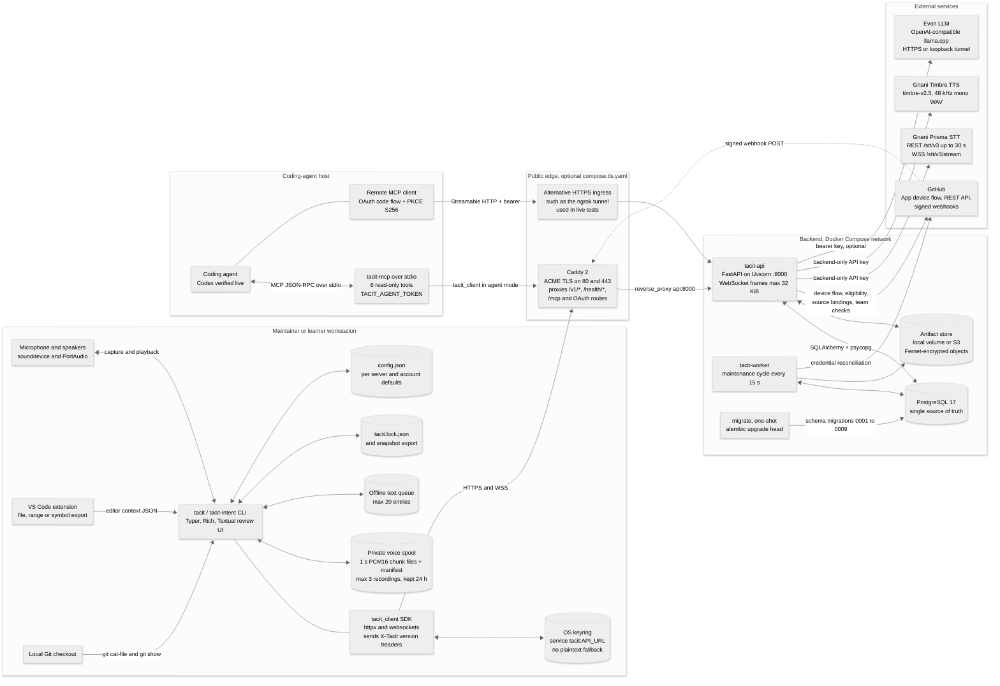
```mermaid
---
config:
  look: neo
  theme: neutral
---
flowchart LR
  subgraph WS["Maintainer or learner workstation"]
    direction TB
    CLI["tacit / tacit-intent CLI<br/>Typer, Rich, Textual review UI"]
    SDK["tacit_client SDK<br/>httpx and websockets<br/>sends X-Tacit version headers"]
    KEYRING[("OS keyring<br/>service tacit:API_URL<br/>no plaintext fallback")]
    SPOOL[("Private voice spool<br/>1 s PCM16 chunk files + manifest<br/>max 3 recordings, kept 24 h")]
    QUEUE[("Offline text queue<br/>max 20 entries")]
    LOCKF[("tacit.lock.json<br/>and snapshot export")]
    CONF[("config.json<br/>per server and account defaults")]
    AUDIO["Microphone and speakers<br/>sounddevice and PortAudio"]
    VSC["VS Code extension<br/>file, range or symbol export"]
    GIT["Local Git checkout"]
  end

  subgraph AG["Coding-agent host"]
    direction TB
    AGENT["Coding agent<br/>Codex verified live"]
    MCPL["tacit-mcp over stdio<br/>6 read-only tools<br/>TACIT_AGENT_TOKEN"]
    MCPR["Remote MCP client<br/>OAuth code flow + PKCE S256"]
  end

  subgraph EDGE["Public edge, optional compose.tls.yaml"]
    CADDY["Caddy 2<br/>ACME TLS on 80 and 443<br/>proxies /v1/*, /health/*,<br/>/mcp and OAuth routes"]
    TUNNEL["Alternative HTTPS ingress<br/>such as the ngrok tunnel<br/>used in live tests"]
  end

  subgraph BE["Backend, Docker Compose network"]
    direction TB
    API["tacit-api<br/>FastAPI on Uvicorn :8000<br/>WebSocket frames max 32 KiB"]
    WORKER["tacit-worker<br/>maintenance cycle every 15 s"]
    MIG["migrate, one-shot<br/>alembic upgrade head"]
    PG[("PostgreSQL 17<br/>single source of truth")]
    OBJ[("Artifact store<br/>local volume or S3<br/>Fernet-encrypted objects")]
  end

  subgraph PROV["External services"]
    direction TB
    GH["GitHub<br/>App device flow, REST API,<br/>signed webhooks"]
    PRISMA["Gnani Prisma STT<br/>REST /stt/v3 up to 30 s<br/>WSS /stt/v3/stream"]
    TIMBRE["Gnani Timbre TTS<br/>timbre-v2.5, 48 kHz mono WAV"]
    EVON["Evon LLM<br/>OpenAI-compatible llama.cpp<br/>HTTPS or loopback tunnel"]
  end

  VSC -->|"editor context JSON"| CLI
  GIT -->|"git cat-file and git show"| CLI
  AUDIO <-->|"capture and playback"| CLI
  CLI --- SDK
  SDK <--> KEYRING
  CLI <--> SPOOL
  CLI <--> QUEUE
  CLI <--> LOCKF
  CLI <--> CONF
  AGENT <-->|"MCP JSON-RPC over stdio"| MCPL
  MCPL -->|"tacit_client in agent mode"| CADDY
  SDK -->|"HTTPS and WSS"| CADDY
  AGENT --- MCPR
  MCPR -->|"Streamable HTTP + bearer"| TUNNEL
  CADDY -->|"reverse_proxy api:8000"| API
  TUNNEL --> API
  GH -.->|"signed webhook POST"| CADDY
  MIG -->|"schema migrations 0001 to 0009"| PG
  API <-->|"SQLAlchemy + psycopg"| PG
  WORKER <--> PG
  API <--> OBJ
  WORKER --> OBJ
  API -->|"device flow, eligibility,<br/>source bindings, team checks"| GH
  WORKER -->|"credential reconciliation"| GH
  API -->|"backend-only API key"| PRISMA
  API -->|"backend-only API key"| TIMBRE
  API -->|"bearer key, optional"| EVON
```

#### Compose services and startup order

`deploy/compose.yaml` keeps the API on host loopback. The `compose.tls.yaml` overlay adds Caddy as the only public listener.

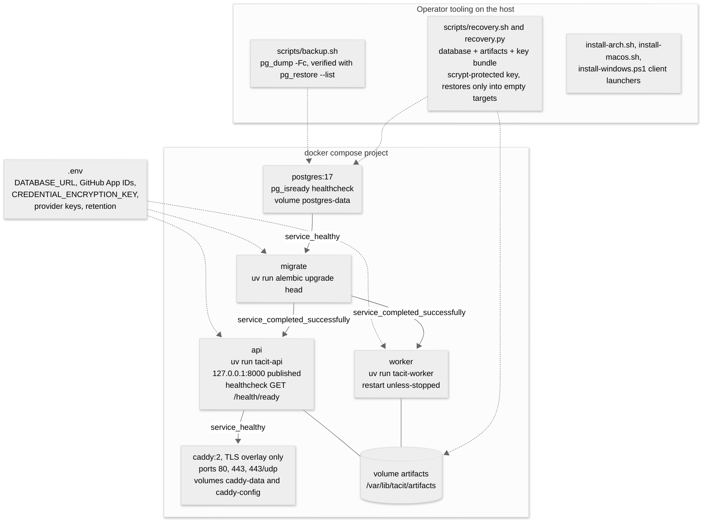
```mermaid
---
config:
  look: neo
  theme: neutral
---
flowchart TB
  ENV[".env<br/>DATABASE_URL, GitHub App IDs,<br/>CREDENTIAL_ENCRYPTION_KEY,<br/>provider keys, retention"]
  subgraph COMPOSE["docker compose project"]
    POSTGRES["postgres:17<br/>pg_isready healthcheck<br/>volume postgres-data"]
    MIGRATE["migrate<br/>uv run alembic upgrade head"]
    APIS["api<br/>uv run tacit-api<br/>127.0.0.1:8000 published<br/>healthcheck GET /health/ready"]
    WORKERS["worker<br/>uv run tacit-worker<br/>restart unless-stopped"]
    CADDYS["caddy:2, TLS overlay only<br/>ports 80, 443, 443/udp<br/>volumes caddy-data and caddy-config"]
    ART[("volume artifacts<br/>/var/lib/tacit/artifacts")]
  end
  ENV -.-> MIGRATE
  ENV -.-> APIS
  ENV -.-> WORKERS
  POSTGRES -->|"service_healthy"| MIGRATE
  MIGRATE -->|"service_completed_successfully"| APIS
  MIGRATE -->|"service_completed_successfully"| WORKERS
  APIS -->|"service_healthy"| CADDYS
  APIS --- ART
  WORKERS --- ART
  subgraph OPS["Operator tooling on the host"]
    BACKUP["scripts/backup.sh<br/>pg_dump -Fc, verified with pg_restore --list"]
    RECOVERY["scripts/recovery.sh and recovery.py<br/>database + artifacts + key bundle<br/>scrypt-protected key, restores only into empty targets"]
    INSTALL["install-arch.sh, install-macos.sh,<br/>install-windows.ps1 client launchers"]
  end
  BACKUP -.-> POSTGRES
  RECOVERY -.-> POSTGRES
  RECOVERY -.-> ART
```

#### Inside one API process

Middleware added last runs first. Version headers are checked before any body is buffered, and errors leave as a uniform `ErrorResponse` that carries the request ID.

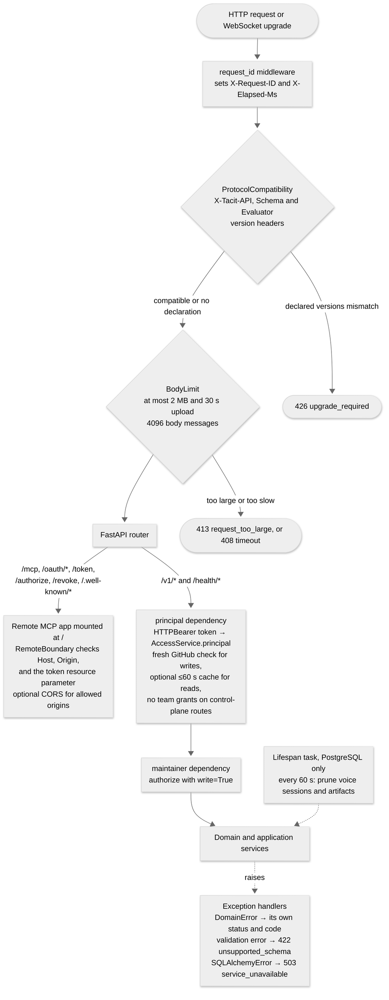
```mermaid
---
config:
  look: neo
  theme: neutral
---
flowchart TB
  REQ(["HTTP request or WebSocket upgrade"])
  RID["request_id middleware<br/>sets X-Request-ID and X-Elapsed-Ms"]
  PC{"ProtocolCompatibility<br/>X-Tacit-API, Schema and Evaluator<br/>version headers"}
  BL{"BodyLimit<br/>at most 2 MB and 30 s upload<br/>4096 body messages"}
  ROUTE["FastAPI router"]
  REMOTE["Remote MCP app mounted at /<br/>RemoteBoundary checks Host, Origin,<br/>and the token resource parameter<br/>optional CORS for allowed origins"]
  DEP1["principal dependency<br/>HTTPBearer token → AccessService.principal<br/>fresh GitHub check for writes,<br/>optional ≤60 s cache for reads,<br/>no team grants on control-plane routes"]
  DEP2["maintainer dependency<br/>authorize with write=True"]
  SVC["Domain and application services"]
  ERR["Exception handlers<br/>DomainError → its own status and code<br/>validation error → 422 unsupported_schema<br/>SQLAlchemyError → 503 service_unavailable"]
  R426(["426 upgrade_required"])
  R413(["413 request_too_large, or 408 timeout"])
  LIFE["Lifespan task, PostgreSQL only<br/>every 60 s: prune voice sessions and artifacts"]
  REQ --> RID --> PC
  PC -->|"declared versions mismatch"| R426
  PC -->|"compatible or no declaration"| BL
  BL -->|"too large or too slow"| R413
  BL --> ROUTE
  ROUTE -->|"/v1/* and /health/*"| DEP1 --> DEP2 --> SVC
  ROUTE -->|"/mcp, /oauth/*, /token,<br/>/authorize, /revoke, /.well-known/*"| REMOTE
  SVC -.->|"raises"| ERR
  LIFE -.-> SVC
```

### Software architecture

#### Workspace packages

Seven uv workspace packages share one set of wire contracts. Domain logic has no I/O, and only the API service imports SQLAlchemy and provider clients.

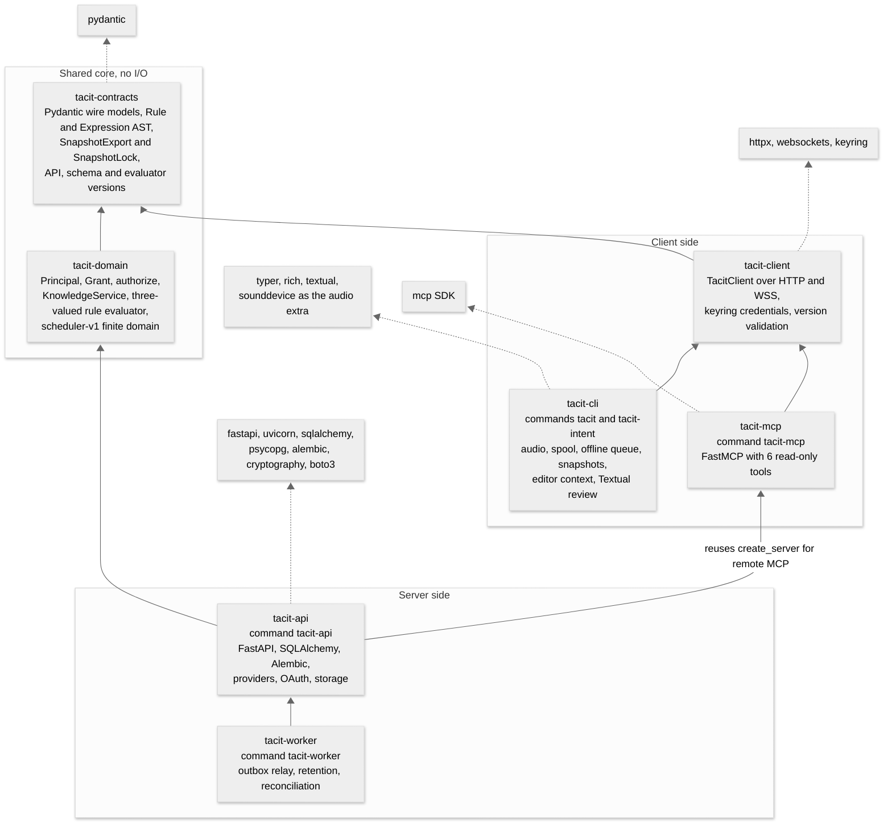
```mermaid
---
config:
  look: neo
  theme: neutral
---
flowchart BT
  subgraph CORE["Shared core, no I/O"]
    CONTRACTS["tacit-contracts<br/>Pydantic wire models, Rule and Expression AST,<br/>SnapshotExport and SnapshotLock,<br/>API, schema and evaluator versions"]
    DOMAIN["tacit-domain<br/>Principal, Grant, authorize,<br/>KnowledgeService, three-valued rule evaluator,<br/>scheduler-v1 finite domain"]
  end
  subgraph CLIENTS["Client side"]
    CLIENT["tacit-client<br/>TacitClient over HTTP and WSS,<br/>keyring credentials, version validation"]
    CLIPKG["tacit-cli<br/>commands tacit and tacit-intent<br/>audio, spool, offline queue, snapshots,<br/>editor context, Textual review"]
    MCP["tacit-mcp<br/>command tacit-mcp<br/>FastMCP with 6 read-only tools"]
  end
  subgraph SERVER["Server side"]
    APIP["tacit-api<br/>command tacit-api<br/>FastAPI, SQLAlchemy, Alembic,<br/>providers, OAuth, storage"]
    WORKERP["tacit-worker<br/>command tacit-worker<br/>outbox relay, retention, reconciliation"]
  end
  EXT1["pydantic"]
  EXT2["httpx, websockets, keyring"]
  EXT3["typer, rich, textual,<br/>sounddevice as the audio extra"]
  EXT4["mcp SDK"]
  EXT5["fastapi, uvicorn, sqlalchemy,<br/>psycopg, alembic, cryptography, boto3"]
  DOMAIN --> CONTRACTS
  CLIENT --> CONTRACTS
  CLIPKG --> CLIENT
  MCP --> CLIENT
  APIP --> DOMAIN
  APIP -->|"reuses create_server for remote MCP"| MCP
  WORKERP --> APIP
  CONTRACTS -.-> EXT1
  CLIENT -.-> EXT2
  CLIPKG -.-> EXT3
  MCP -.-> EXT4
  APIP -.-> EXT5
```

#### API module map

Routes in `app.py` are thin. Each one resolves a principal and delegates to a service. Services share `PublicationService.write_repository`, which re-checks authority under row locks.

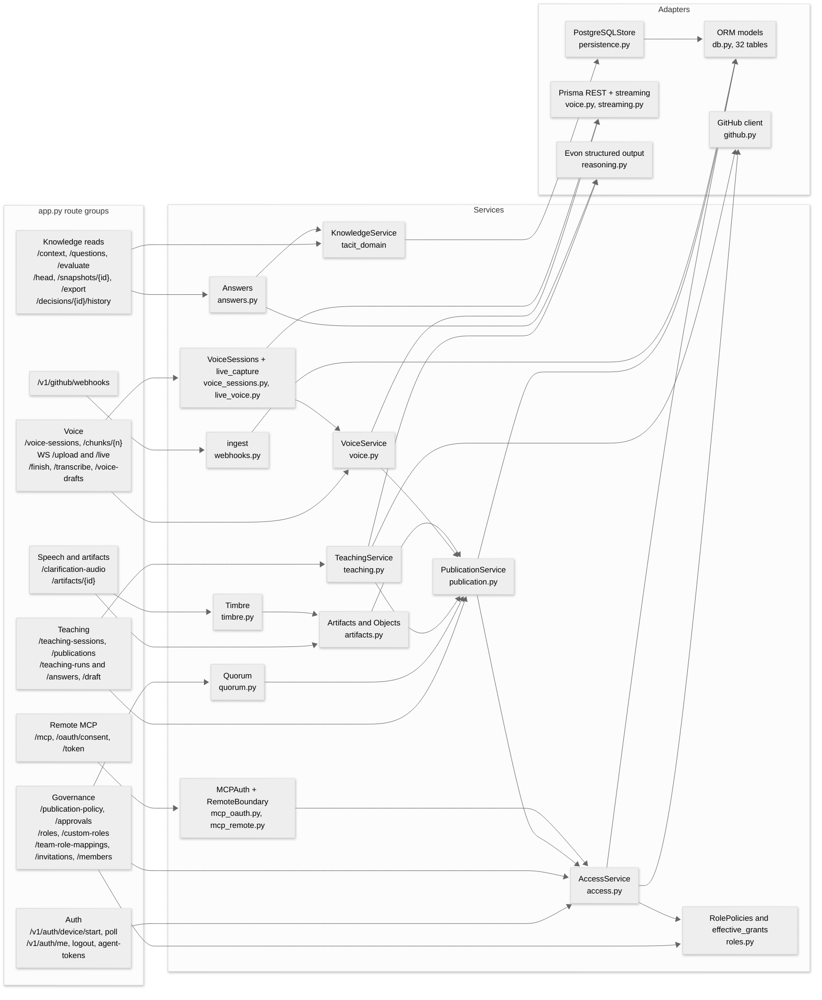
```mermaid
---
config:
  look: neo
  theme: neutral
---
flowchart LR
  subgraph ROUTES["app.py route groups"]
    RA["Auth<br/>/v1/auth/device/start, poll<br/>/v1/auth/me, logout, agent-tokens"]
    RK["Knowledge reads<br/>/context, /questions, /evaluate<br/>/head, /snapshots/{id}, /export<br/>/decisions/{id}/history"]
    RT["Teaching<br/>/teaching-sessions, /publications<br/>/teaching-runs and /answers, /draft"]
    RQ["Governance<br/>/publication-policy, /approvals<br/>/roles, /custom-roles<br/>/team-role-mappings, /invitations, /members"]
    RV["Voice<br/>/voice-sessions, /chunks/{n}<br/>WS /upload and /live<br/>/finish, /transcribe, /voice-drafts"]
    RS["Speech and artifacts<br/>/clarification-audio<br/>/artifacts/{id}"]
    RW["/v1/github/webhooks"]
    RM["Remote MCP<br/>/mcp, /oauth/consent, /token"]
  end
  subgraph SERVICES["Services"]
    ACC["AccessService<br/>access.py"]
    KS["KnowledgeService<br/>tacit_domain"]
    PUB["PublicationService<br/>publication.py"]
    QUO["Quorum<br/>quorum.py"]
    ROL["RolePolicies and effective_grants<br/>roles.py"]
    TEA["TeachingService<br/>teaching.py"]
    ANS["Answers<br/>answers.py"]
    VS["VoiceService<br/>voice.py"]
    VSS["VoiceSessions + live_capture<br/>voice_sessions.py, live_voice.py"]
    ARTS["Artifacts and Objects<br/>artifacts.py"]
    TIM["Timbre<br/>timbre.py"]
    OAUTH["MCPAuth + RemoteBoundary<br/>mcp_oauth.py, mcp_remote.py"]
    WH["ingest<br/>webhooks.py"]
  end
  subgraph ADAPTERS["Adapters"]
    STORE["PostgreSQLStore<br/>persistence.py"]
    DB["ORM models<br/>db.py, 32 tables"]
    GHA["GitHub client<br/>github.py"]
    PRI["Prisma REST + streaming<br/>voice.py, streaming.py"]
    EVA["Evon structured output<br/>reasoning.py"]
  end
  RA --> ACC
  RK --> KS
  RK --> ANS
  RT --> PUB
  RT --> TEA
  RQ --> QUO
  RQ --> ROL
  RQ --> ACC
  RV --> VSS
  RV --> VS
  RS --> TIM
  RS --> ARTS
  RW --> WH
  RM --> OAUTH
  KS --> STORE --> DB
  ACC --> GHA
  ACC --> DB
  ACC --> ROL
  PUB --> ACC
  PUB --> DB
  QUO --> PUB
  TEA --> PUB
  TEA --> EVA
  TEA --> GHA
  ANS --> KS
  ANS --> EVA
  VS --> PUB
  VS --> PRI
  VSS --> VS
  VSS --> PRI
  TIM --> ARTS
  ARTS --> PUB
  OAUTH --> ACC
  WH --> DB
```

### System design

#### Trust boundaries

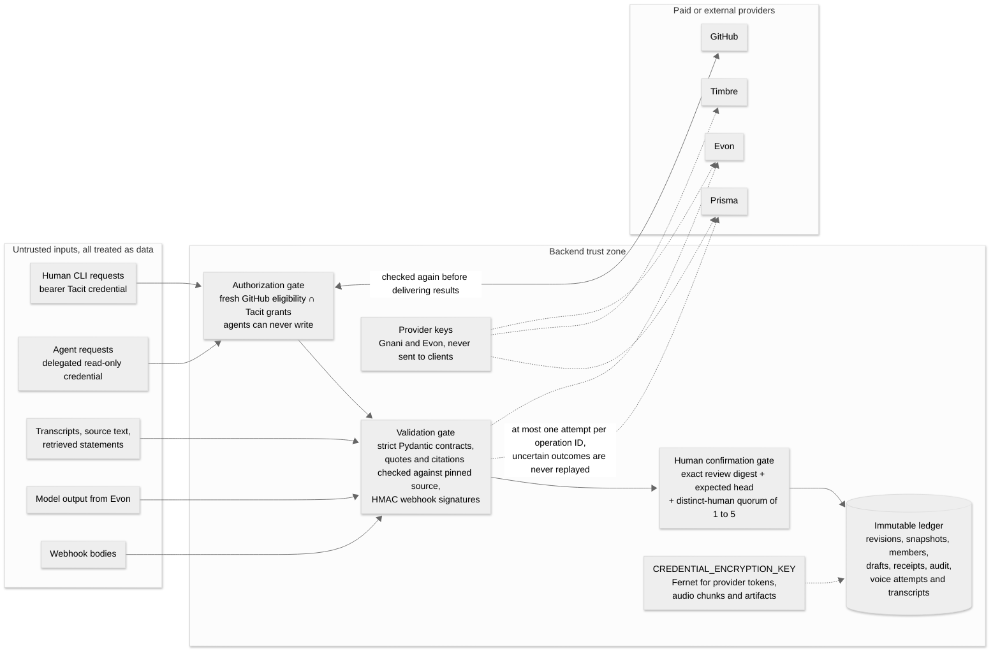
```mermaid
---
config:
  look: neo
  theme: neutral
---
flowchart LR
  subgraph UNTRUSTED["Untrusted inputs, all treated as data"]
    U1["Human CLI requests<br/>bearer Tacit credential"]
    U2["Agent requests<br/>delegated read-only credential"]
    U3["Transcripts, source text,<br/>retrieved statements"]
    U4["Model output from Evon"]
    U5["Webhook bodies"]
  end
  subgraph BACKEND["Backend trust zone"]
    direction TB
    AUTHZ["Authorization gate<br/>fresh GitHub eligibility ∩ Tacit grants<br/>agents can never write"]
    VALID["Validation gate<br/>strict Pydantic contracts,<br/>quotes and citations checked against pinned source,<br/>HMAC webhook signatures"]
    HUMAN["Human confirmation gate<br/>exact review digest + expected head<br/>+ distinct-human quorum of 1 to 5"]
    LEDGER[("Immutable ledger<br/>revisions, snapshots, members,<br/>drafts, receipts, audit,<br/>voice attempts and transcripts")]
    KEY["CREDENTIAL_ENCRYPTION_KEY<br/>Fernet for provider tokens,<br/>audio chunks and artifacts"]
    PKEYS["Provider keys<br/>Gnani and Evon, never sent to clients"]
  end
  subgraph PAID["Paid or external providers"]
    P1["Prisma"]
    P2["Timbre"]
    P3["Evon"]
    P4["GitHub"]
  end
  U1 --> AUTHZ
  U2 --> AUTHZ
  U5 --> VALID
  U3 --> VALID
  U4 --> VALID
  AUTHZ --> VALID --> HUMAN --> LEDGER
  PKEYS -.-> P1
  PKEYS -.-> P2
  PKEYS -.-> P3
  AUTHZ <-->|"checked again before delivering results"| P4
  VALID -.->|"at most one attempt per operation ID,<br/>uncertain outcomes are never replayed"| P1
  VALID -.-> P3
  KEY -.-> LEDGER
```

#### Authorization decision

`authorize()` in `tacit_domain` is the pure check. Writes go through `write_repository`, which repeats the check under row locks after any slow external call.

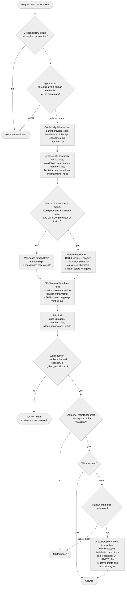
```mermaid
---
config:
  look: neo
  theme: neutral
---
flowchart TB
  START(["Request with bearer token"])
  CRED{"Credential row exists,<br/>not revoked, not expired?"}
  DELEG{"Agent token:<br/>parent is a valid human credential<br/>for the same user?"}
  ELIG["GitHub eligibility for the parent provider token<br/>installations of this App,<br/>repositories, org membership"]
  SYNC["sync: create or refresh workspaces,<br/>installations, repositories, memberships;<br/>bootstrap learner, admin and maintainer roles"]
  MEM{"Workspace member is active,<br/>workspace and installation active,<br/>and owner, org member or invited?"}
  REPOS["Visible repositories = GitHub-visible ∩ enabled<br/>∩ invitation scope for outside collaborators<br/>∩ token scope for agents"]
  GRANTS["Effective grants = direct roles<br/>+ custom roles mapped to learner or maintainer<br/>+ GitHub team mappings verified live"]
  P["Principal<br/>user_id, agent, memberships,<br/>github_repositories, grants"]
  AZ1{"Workspace in memberships and<br/>repository in github_repositories?"}
  AZ2{"Learner or maintainer grant<br/>on workspace or this repository?"}
  AZ3{"Write request?"}
  AZ4{"Human and holds maintainer?"}
  LOCK["write_repository, in one transaction:<br/>lock workspace, installation, repository<br/>and credential FOR UPDATE, then<br/>re-derive grants and authorize again"]
  OK(["Allowed"])
  N401(["401 unauthenticated"])
  N404(["404 not_found<br/>existence is not revealed"])
  N403(["403 forbidden"])
  START --> CRED
  CRED -->|"no"| N401
  CRED -->|"yes"| DELEG
  DELEG -->|"invalid"| N401
  DELEG -->|"valid or human"| ELIG --> SYNC --> MEM
  MEM -->|"no"| SKIP["Workspace omitted from memberships<br/>its repositories stay invisible"]
  MEM -->|"yes"| REPOS
  SKIP --> GRANTS
  REPOS --> GRANTS --> P --> AZ1
  AZ1 -->|"no"| N404
  AZ1 -->|"yes"| AZ2
  AZ2 -->|"no"| N403
  AZ2 -->|"yes"| AZ3
  AZ3 -->|"read"| OK
  AZ3 -->|"write"| AZ4
  AZ4 -->|"no, or agent"| N403
  AZ4 -->|"yes"| LOCK --> OK
```

#### Data model: identity and access

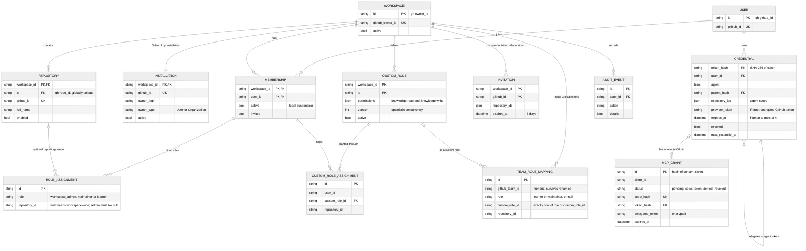
```mermaid
---
config:
  look: neo
  theme: neutral
---
erDiagram
  USER ||--o{ MEMBERSHIP : "joins"
  WORKSPACE ||--o{ MEMBERSHIP : "has"
  WORKSPACE ||--|| INSTALLATION : "GitHub App installation"
  WORKSPACE ||--o{ REPOSITORY : "contains"
  MEMBERSHIP ||--o{ ROLE_ASSIGNMENT : "direct roles"
  REPOSITORY |o--o{ ROLE_ASSIGNMENT : "optional repository scope"
  WORKSPACE ||--o{ CUSTOM_ROLE : "defines"
  CUSTOM_ROLE ||--o{ CUSTOM_ROLE_ASSIGNMENT : "granted through"
  MEMBERSHIP ||--o{ CUSTOM_ROLE_ASSIGNMENT : "holds"
  WORKSPACE ||--o{ TEAM_ROLE_MAPPING : "maps GitHub teams"
  CUSTOM_ROLE |o--o{ TEAM_ROLE_MAPPING : "or a custom role"
  WORKSPACE ||--o{ INVITATION : "scoped outside collaborators"
  USER ||--o{ CREDENTIAL : "owns"
  CREDENTIAL ||--o{ CREDENTIAL : "delegates to agent tokens"
  CREDENTIAL |o--o{ MCP_GRANT : "backs remote OAuth"
  WORKSPACE ||--o{ AUDIT_EVENT : "records"

  USER {
    string id PK "gh-github_id"
    string github_id UK
  }
  WORKSPACE {
    string id PK "gh-owner_id"
    string github_owner_id UK
    bool active
  }
  INSTALLATION {
    string workspace_id PK, FK
    string github_id UK
    string owner_login
    string owner_type "User or Organization"
    bool active
  }
  REPOSITORY {
    string workspace_id PK, FK
    string id PK "gh-repo_id, globally unique"
    string github_id UK
    string full_name
    bool enabled
  }
  MEMBERSHIP {
    string workspace_id PK, FK
    string user_id PK, FK
    bool active "local suspension"
    bool invited
  }
  ROLE_ASSIGNMENT {
    string id PK
    string role "workspace_admin, maintainer or learner"
    string repository_id "null means workspace-wide; admin must be null"
  }
  CUSTOM_ROLE {
    string workspace_id PK
    string id PK
    json permissions "knowledge.read and knowledge.write"
    int version "optimistic concurrency"
    bool active
  }
  CUSTOM_ROLE_ASSIGNMENT {
    string id PK
    string user_id
    string custom_role_id FK
    string repository_id
  }
  TEAM_ROLE_MAPPING {
    string id PK
    string github_team_id "numeric, survives renames"
    string role "learner or maintainer, or null"
    string custom_role_id "exactly one of role or custom_role_id"
    string repository_id
  }
  INVITATION {
    string workspace_id PK
    string github_id PK
    json repository_ids
    datetime expires_at "7 days"
  }
  CREDENTIAL {
    string token_hash PK "SHA-256 of token"
    string user_id FK
    bool agent
    string parent_hash FK
    json repository_ids "agent scope"
    string provider_token "Fernet-encrypted GitHub token"
    datetime expires_at "human at most 8 h"
    bool revoked
    datetime next_reconcile_at
  }
  MCP_GRANT {
    string id PK "hash of consent ticket"
    string client_id
    string status "pending, code, token, denied, revoked"
    string code_hash UK
    string token_hash UK
    string delegated_token "encrypted"
    datetime expires_at
  }
  AUDIT_EVENT {
    string id PK
    string actor_id FK
    string action
    json details
  }
```

#### Data model: knowledge, teaching and voice

Tables marked IMMUTABLE have a PostgreSQL trigger, `tacit_reject_mutation()`, that rejects every UPDATE and DELETE.


```mermaid
---
config:
  look: neo
  theme: neutral
---
erDiagram
  REPOSITORY ||--o| REPOSITORY_HEAD : "current head"
  REPOSITORY ||--o{ SNAPSHOT : "versions"
  SNAPSHOT |o--o{ SNAPSHOT : "parent_snapshot_id lineage"
  SNAPSHOT ||--|{ SNAPSHOT_MEMBER : "manifest"
  DECISION_REVISION ||--o{ SNAPSHOT_MEMBER : "included in"
  DECISION_REVISION |o--o{ DECISION_REVISION : "parent_revision_id"
  REPOSITORY_HEAD }o--|| SNAPSHOT : "points to"
  REPOSITORY ||--o{ TEACHING_DRAFT : "private drafts"
  TEACHING_DRAFT ||--o| PUBLICATION_RECEIPT : "published once"
  TEACHING_DRAFT ||--o{ DRAFT_APPROVAL : "quorum votes"
  REPOSITORY ||--o| PUBLICATION_POLICY : "required maintainers"
  DECISION_REVISION ||--o| PUBLICATION_INDEX : "outbox projection"
  REPOSITORY ||--o{ VOICE_SESSION : "recordings"
  VOICE_SESSION ||--o{ VOICE_CHUNK : "1 s encrypted PCM"
  VOICE_ATTEMPT ||--o| VOICE_TRANSCRIPT : "provider result"
  REPOSITORY ||--o{ TEACHING_RUN : "grounded extraction"
  REPOSITORY ||--o{ MODEL_OPERATION : "paid-call reservations"
  REPOSITORY ||--o{ ARTIFACT : "synthesized audio"
  WORKSPACE ||--o{ OUTBOX_EVENT : "transactional outbox"

  DECISION_REVISION {
    string id PK "IMMUTABLE"
    string decision_id "stable across revisions"
    string parent_revision_id FK
    string confirmed_by FK
    json content "Decision: statement, files, source_commit, sources, evidence, rule, grounding"
  }
  SNAPSHOT {
    string id PK "IMMUTABLE"
    string source_commit "40-char SHA"
    string parent_snapshot_id FK
    string digest "manifest SHA-256"
  }
  SNAPSHOT_MEMBER {
    string snapshot_id PK "IMMUTABLE"
    string revision_id PK
  }
  REPOSITORY_HEAD {
    string repository_id PK
    string snapshot_id FK
    int version "bumped on every publication"
  }
  TEACHING_DRAFT {
    string id PK "IMMUTABLE"
    string author_id FK
    string operation_id "unique per repository and author"
    string request_digest "idempotency check"
    json payload "DraftView with review_digest"
  }
  PUBLICATION_RECEIPT {
    string operation_id PK "IMMUTABLE"
    string actor_id PK
    string draft_id UK
    json result "PublicationResponse"
  }
  DRAFT_APPROVAL {
    string draft_id PK
    string user_id PK
    string credential_hash FK "re-verified at publication"
    string review_digest
    int policy_version
  }
  PUBLICATION_POLICY {
    string repository_id PK
    int required_maintainers "1 to 5"
    int version
  }
  OUTBOX_EVENT {
    string id PK
    string idempotency_key UK
    json payload "knowledge.confirmed"
    datetime processed_at
    int attempts "max 8, exponential backoff"
  }
  PUBLICATION_INDEX {
    string revision_id PK
    string statement
    string source_commit
  }
  VOICE_SESSION {
    string id PK
    string operation_id
    json context "VoiceSessionRequest"
    string status
    int chunks "max 895"
    string audio_sha256
    datetime expires_at "retention, default 24 h"
  }
  VOICE_CHUNK {
    int sequence PK
    string sha256
    bytes encrypted_pcm "32000 bytes or fewer"
  }
  VOICE_ATTEMPT {
    string operation_id PK "IMMUTABLE, at-most-once reservation"
    string request_digest
  }
  VOICE_TRANSCRIPT {
    string operation_id PK "IMMUTABLE"
    json payload "request + VoiceEvidence"
  }
  TEACHING_RUN {
    string id PK
    int version "optimistic concurrency"
    string status
    json payload "input, view, prepare_digest"
    datetime expires_at "1 day"
  }
  MODEL_OPERATION {
    string operation_id PK
    string kind PK "tts, clarification, question-human, question-agent"
    string status "processing, completed, expired"
    json result
  }
  ARTIFACT {
    string id PK
    string object_key
    string sha256
    string status "pending or ready"
    datetime deleted_at "tombstone"
  }
```

#### Snapshot lineage and supersession

Publishing never edits a snapshot. It writes a new manifest that keeps every other decision's current revision, plus the new revision. Superseding a decision drops its older revision from the new manifest, but old snapshots stay readable forever.

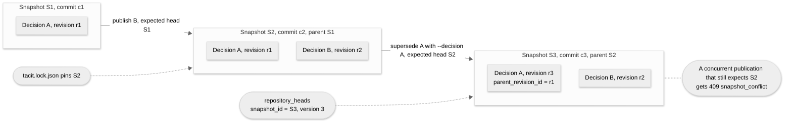
```mermaid
---
config:
  look: neo
  theme: neutral
---
flowchart LR
  subgraph S1["Snapshot S1, commit c1"]
    A1["Decision A, revision r1"]
  end
  subgraph S2["Snapshot S2, commit c2, parent S1"]
    A1b["Decision A, revision r1"]
    B1["Decision B, revision r2"]
  end
  subgraph S3["Snapshot S3, commit c3, parent S2"]
    A2["Decision A, revision r3<br/>parent_revision_id = r1"]
    B1b["Decision B, revision r2"]
  end
  HEAD(["repository_heads<br/>snapshot_id = S3, version 3"])
  LOCKFILE(["tacit.lock.json pins S2"])
  S1 -->|"publish B, expected head S1"| S2
  S2 -->|"supersede A with --decision A, expected head S2"| S3
  HEAD -.-> S3
  LOCKFILE -.-> S2
  STALE(["A concurrent publication that still expects S2<br/>gets 409 snapshot_conflict"])
  S3 -.- STALE
```

The manifest digest is `sha256` over canonical JSON of `{schema_version: 1, repository_id, parent_snapshot_id, source_commit, revision_ids sorted}`. The client recomputes it when it validates an export.

#### Lifecycles

Durable voice session, as stored in `voice_sessions.status`:

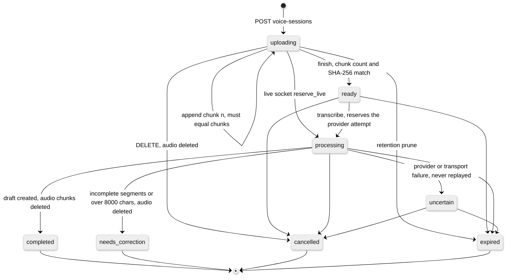
```mermaid
---
config:
  look: neo
  theme: neutral
---
stateDiagram-v2
  [*] --> uploading : POST voice-sessions
  uploading --> uploading : append chunk n, must equal chunks
  uploading --> ready : finish, chunk count and SHA-256 match
  uploading --> processing : live socket reserve_live
  ready --> processing : transcribe, reserves the provider attempt
  processing --> completed : draft created, audio chunks deleted
  processing --> needs_correction : incomplete segments or over 8000 chars, audio deleted
  processing --> uncertain : provider or transport failure, never replayed
  uploading --> cancelled : DELETE, audio deleted
  ready --> cancelled
  processing --> cancelled
  uncertain --> cancelled
  uploading --> expired : retention prune
  ready --> expired
  processing --> expired
  uncertain --> expired
  completed --> [*]
  needs_correction --> [*]
  cancelled --> [*]
  expired --> [*]
```

Grounded teaching run (`teaching_runs.status`), Evon-assisted:

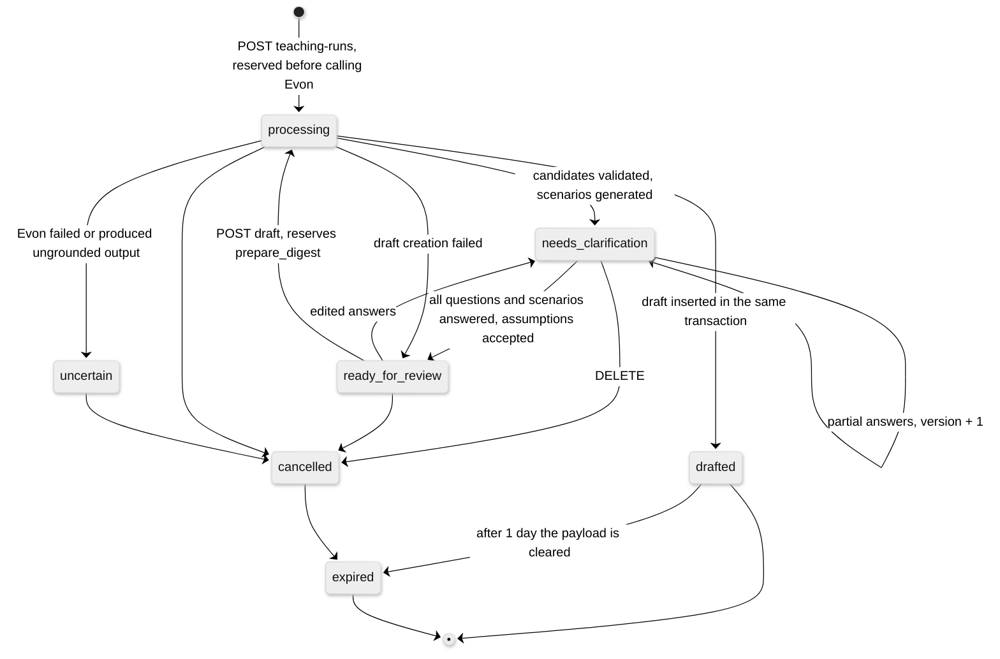
```mermaid
---
config:
  look: neo
  theme: neutral
---
stateDiagram-v2
  [*] --> processing : POST teaching-runs, reserved before calling Evon
  processing --> needs_clarification : candidates validated, scenarios generated
  processing --> uncertain : Evon failed or produced ungrounded output
  needs_clarification --> needs_clarification : partial answers, version + 1
  needs_clarification --> ready_for_review : all questions and scenarios answered, assumptions accepted
  ready_for_review --> needs_clarification : edited answers
  ready_for_review --> processing : POST draft, reserves prepare_digest
  processing --> drafted : draft inserted in the same transaction
  processing --> ready_for_review : draft creation failed
  needs_clarification --> cancelled : DELETE
  ready_for_review --> cancelled
  processing --> cancelled
  uncertain --> cancelled
  drafted --> expired : after 1 day the payload is cleared
  cancelled --> expired
  drafted --> [*]
  expired --> [*]
```

Draft, approval and publication:

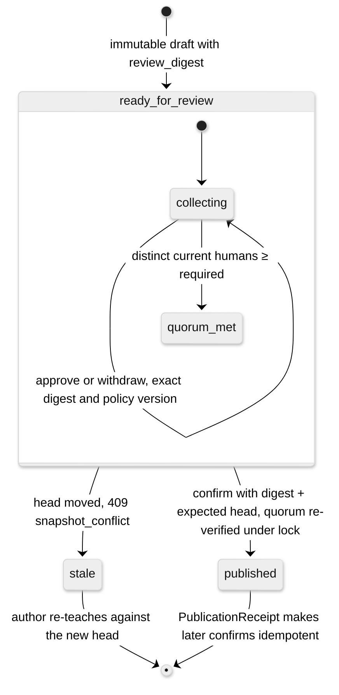
```mermaid
---
config:
  look: neo
  theme: neutral
---
stateDiagram-v2
  [*] --> ready_for_review : immutable draft with review_digest
  state ready_for_review {
    [*] --> collecting
    collecting --> collecting : approve or withdraw, exact digest and policy version
    collecting --> quorum_met : distinct current humans ≥ required
  }
  ready_for_review --> published : confirm with digest + expected head, quorum re-verified under lock
  ready_for_review --> stale : head moved, 409 snapshot_conflict
  stale --> [*] : author re-teaches against the new head
  published --> [*] : PublicationReceipt makes later confirms idempotent
```

Offline text queue entry, stored on the client:

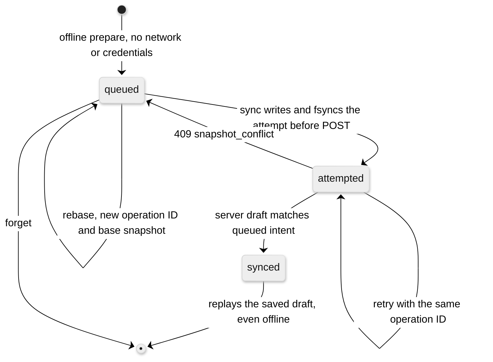
```mermaid
---
config:
  look: neo
  theme: neutral
---
stateDiagram-v2
  [*] --> queued : offline prepare, no network or credentials
  queued --> queued : rebase, new operation ID and base snapshot
  queued --> attempted : sync writes and fsyncs the attempt before POST
  attempted --> queued : 409 snapshot_conflict
  attempted --> synced : server draft matches queued intent
  attempted --> attempted : retry with the same operation ID
  synced --> [*] : replays the saved draft, even offline
  queued --> [*] : forget
```

Remote MCP OAuth grant (`mcp_grants.status`):

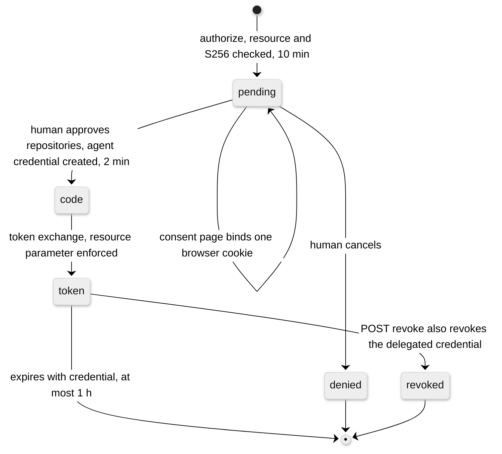
```mermaid
---
config:
  look: neo
  theme: neutral
---
stateDiagram-v2
  [*] --> pending : authorize, resource and S256 checked, 10 min
  pending --> pending : consent page binds one browser cookie
  pending --> code : human approves repositories, agent credential created, 2 min
  pending --> denied : human cancels
  code --> token : token exchange, resource parameter enforced
  token --> revoked : POST revoke also revokes the delegated credential
  token --> [*] : expires with credential, at most 1 h
  denied --> [*]
  revoked --> [*]
```

#### Bounds and limits

| Area | Limit enforced in code |
|---|---|
| Context reads | at most 100 decisions per page, 50 file filters, 64,000 serialized characters per page |
| Rules | expression depth 6, at most 64 nodes, 16 predicates; scheduler-v1 facts only |
| Drafts | statement 8,000 chars, 20 files, canonical repository-relative paths |
| Voice | 1 s chunks of 32,000 bytes, at most 895 s; REST transcription up to 30 s; 3 active sessions per user |
| Live voice | GitHub re-check every 5 s; 20 s client idle timeout; 1,030 s total |
| Evon | 48,000 input chars by default, at most 4,096 output tokens, 256 KiB response, 120 s |
| Credentials | human at most 8 h; agent tokens 60 s to 8 h; remote OAuth at most 1 h |
| Governance | quorum 1 to 5; 20 approvals per draft; 100 custom roles; 20 team mappings |
| Uploads | HTTP body 2 MB and 30 s; WebSocket frames 32 KiB |

### Data flow

#### End-to-end knowledge flow


```mermaid
---
config:
  look: neo
  theme: neutral
---
flowchart LR
  subgraph CAPTURE["1. Capture"]
    T1["Typed intent<br/>teach --text-file"]
    T2["Voice<br/>teach-voice, optionally --live-transcript"]
    T3["Offline queue<br/>offline prepare, then sync"]
    T4["Editor selection<br/>VS Code export"]
  end
  subgraph GROUND["2. Ground and bind"]
    G1["GitHub: commit exists,<br/>paths are regular files,<br/>record blob SHAs"]
    G2["Prisma transcript<br/>original kept immutable"]
    G3["Optional Evon candidates<br/>quotes and citations verified"]
    G4["Distinguishing scenarios<br/>+ human clarification"]
  end
  subgraph REVIEW["3. Review"]
    R1["Private TeachingDraft<br/>review_digest"]
    R2["Human corrections<br/>layered over original evidence"]
    R3["Quorum approvals<br/>for the exact digest"]
  end
  subgraph PUBLISH["4. Publish, one transaction"]
    P1["DecisionRevision"]
    P2["Snapshot + members"]
    P3["RepositoryHead version + 1"]
    P4["Receipt + Audit + Outbox"]
  end
  subgraph PROJECT["5. Project"]
    W1["Worker relay<br/>PublicationIndex"]
  end
  subgraph CONSUME["6. Consume"]
    C1["context"]
    C2["ask, or ask --reason"]
    C3["evaluate"]
    C4["history"]
    C5["MCP tools over stdio or remote"]
    C6["Lockfile + offline export"]
  end
  T1 --> G1
  T2 --> G2 --> G1
  T3 --> G1
  T4 --> G3
  G1 --> R1
  G1 --> G3 --> G4 --> R1
  R1 --> R2 --> R1
  R1 --> R3 --> PUBLISH
  R1 -->|"confirm"| PUBLISH
  P1 --- P2 --- P3 --- P4
  P4 --> W1
  PUBLISH --> CONSUME
```

#### GitHub device login

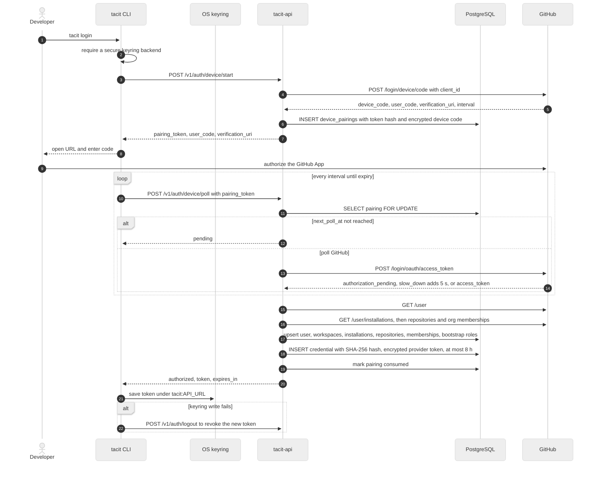
```mermaid
---
config:
  look: neo
  theme: neutral
---
sequenceDiagram
  autonumber
  actor Dev as Developer
  participant CLI as tacit CLI
  participant KR as OS keyring
  participant API as tacit-api
  participant DB as PostgreSQL
  participant GH as GitHub
  Dev->>CLI: tacit login
  CLI->>CLI: require a secure keyring backend
  CLI->>API: POST /v1/auth/device/start
  API->>GH: POST /login/device/code with client_id
  GH-->>API: device_code, user_code, verification_uri, interval
  API->>DB: INSERT device_pairings with token hash and encrypted device code
  API-->>CLI: pairing_token, user_code, verification_uri
  CLI-->>Dev: open URL and enter code
  Dev->>GH: authorize the GitHub App
  loop every interval until expiry
    CLI->>API: POST /v1/auth/device/poll with pairing_token
    API->>DB: SELECT pairing FOR UPDATE
    alt next_poll_at not reached
      API-->>CLI: pending
    else poll GitHub
      API->>GH: POST /login/oauth/access_token
      GH-->>API: authorization_pending, slow_down adds 5 s, or access_token
    end
  end
  API->>GH: GET /user
  API->>GH: GET /user/installations, then repositories and org memberships
  API->>DB: upsert user, workspaces, installations, repositories, memberships, bootstrap roles
  API->>DB: INSERT credential with SHA-256 hash, encrypted provider token, at most 8 h
  API->>DB: mark pairing consumed
  API-->>CLI: authorized, token, expires_in
  CLI->>KR: save token under tacit:API_URL
  alt keyring write fails
    CLI->>API: POST /v1/auth/logout to revoke the new token
  end
```

#### Text teaching to a private draft

Slow GitHub calls happen between two transactions, so no lock is held during network I/O. Everything is checked again after the calls return.

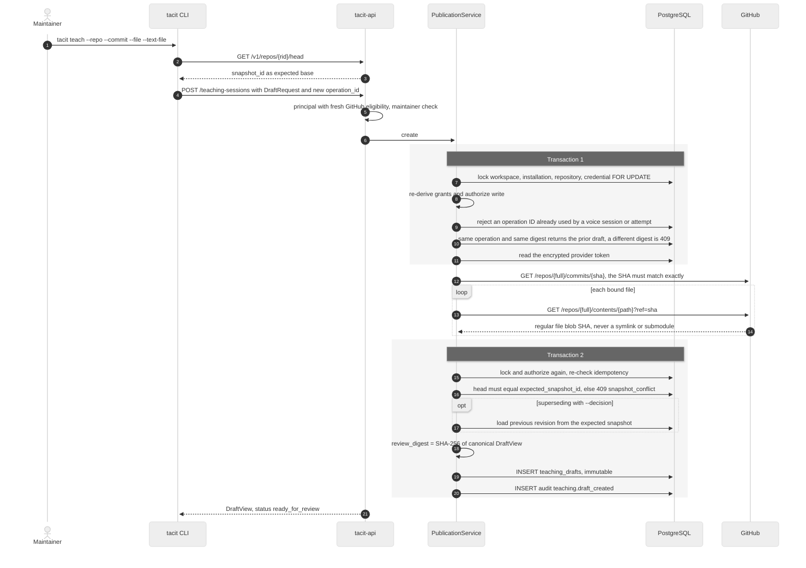
```mermaid
---
config:
  look: neo
  theme: neutral
---
sequenceDiagram
  autonumber
  actor M as Maintainer
  participant CLI as tacit CLI
  participant API as tacit-api
  participant PUB as PublicationService
  participant DB as PostgreSQL
  participant GH as GitHub
  M->>CLI: tacit teach --repo --commit --file --text-file
  CLI->>API: GET /v1/repos/{rid}/head
  API-->>CLI: snapshot_id as expected base
  CLI->>API: POST /teaching-sessions with DraftRequest and new operation_id
  API->>API: principal with fresh GitHub eligibility, maintainer check
  API->>PUB: create
  rect rgba(127,127,127,0.08)
    note over PUB,DB: Transaction 1
    PUB->>DB: lock workspace, installation, repository, credential FOR UPDATE
    PUB->>PUB: re-derive grants and authorize write
    PUB->>DB: reject an operation ID already used by a voice session or attempt
    PUB->>DB: same operation and same digest returns the prior draft, a different digest is 409
    PUB->>DB: read the encrypted provider token
  end
  PUB->>GH: GET /repos/{full}/commits/{sha}, the SHA must match exactly
  loop each bound file
    PUB->>GH: GET /repos/{full}/contents/{path}?ref=sha
    GH-->>PUB: regular file blob SHA, never a symlink or submodule
  end
  rect rgba(127,127,127,0.08)
    note over PUB,DB: Transaction 2
    PUB->>DB: lock and authorize again, re-check idempotency
    PUB->>DB: head must equal expected_snapshot_id, else 409 snapshot_conflict
    opt superseding with --decision
      PUB->>DB: load previous revision from the expected snapshot
    end
    PUB->>PUB: review_digest = SHA-256 of canonical DraftView
    PUB->>DB: INSERT teaching_drafts, immutable
    PUB->>DB: INSERT audit teaching.draft_created
  end
  API-->>CLI: DraftView, status ready_for_review
```

#### Approval quorum, confirmation and projection

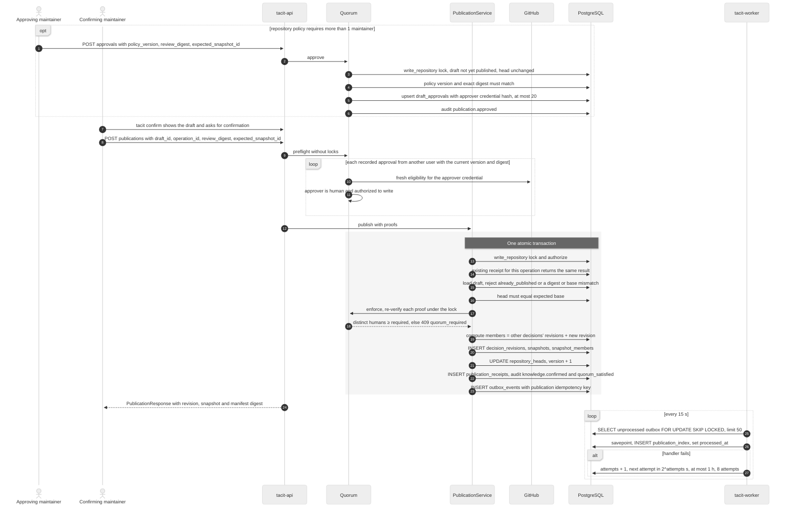
```mermaid
---
config:
  look: neo
  theme: neutral
---
sequenceDiagram
  autonumber
  actor A as Approving maintainer
  actor M as Confirming maintainer
  participant API as tacit-api
  participant Q as Quorum
  participant PUB as PublicationService
  participant GH as GitHub
  participant DB as PostgreSQL
  participant W as tacit-worker
  opt repository policy requires more than 1 maintainer
    A->>API: POST approvals with policy_version, review_digest, expected_snapshot_id
    API->>Q: approve
    Q->>DB: write_repository lock, draft not yet published, head unchanged
    Q->>DB: policy version and exact digest must match
    Q->>DB: upsert draft_approvals with approver credential hash, at most 20
    Q->>DB: audit publication.approved
  end
  M->>API: tacit confirm shows the draft and asks for confirmation
  M->>API: POST publications with draft_id, operation_id, review_digest, expected_snapshot_id
  API->>Q: preflight without locks
  loop each recorded approval from another user with the current version and digest
    Q->>GH: fresh eligibility for the approver credential
    Q->>Q: approver is human and authorized to write
  end
  API->>PUB: publish with proofs
  rect rgba(127,127,127,0.08)
    note over PUB,DB: One atomic transaction
    PUB->>DB: write_repository lock and authorize
    PUB->>DB: existing receipt for this operation returns the same result
    PUB->>DB: load draft, reject already_published or a digest or base mismatch
    PUB->>DB: head must equal expected base
    PUB->>Q: enforce, re-verify each proof under the lock
    Q-->>PUB: distinct humans ≥ required, else 409 quorum_required
    PUB->>DB: compute members = other decisions' revisions + new revision
    PUB->>DB: INSERT decision_revisions, snapshots, snapshot_members
    PUB->>DB: UPDATE repository_heads, version + 1
    PUB->>DB: INSERT publication_receipts, audit knowledge.confirmed and quorum_satisfied
    PUB->>DB: INSERT outbox_events with publication idempotency key
  end
  API-->>M: PublicationResponse with revision, snapshot and manifest digest
  loop every 15 s
    W->>DB: SELECT unprocessed outbox FOR UPDATE SKIP LOCKED, limit 50
    W->>DB: savepoint, INSERT publication_index, set processed_at
    alt handler fails
      W->>DB: attempts + 1, next attempt in 2^attempts s, at most 1 h, 8 attempts
    end
  end
```

#### Durable voice capture and transcription

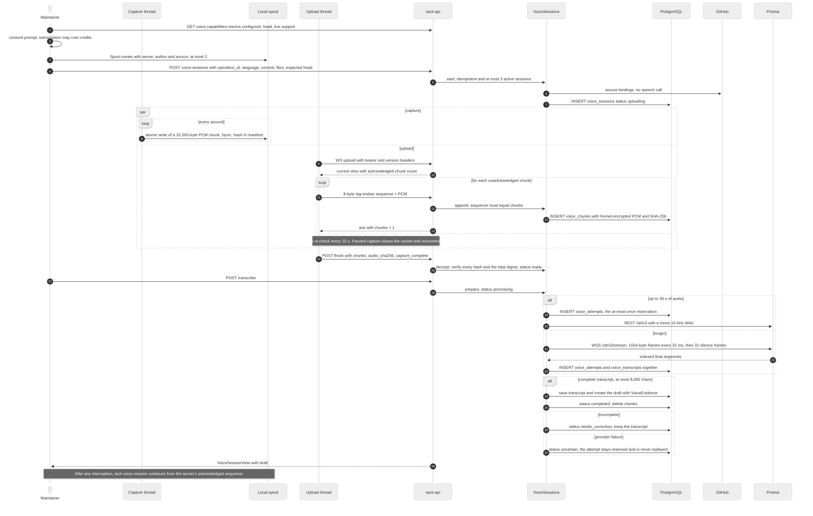
```mermaid
---
config:
  look: neo
  theme: neutral
---
sequenceDiagram
  autonumber
  actor M as Maintainer
  participant CAP as Capture thread
  participant SP as Local spool
  participant UP as Upload thread
  participant API as tacit-api
  participant VSS as VoiceSessions
  participant DB as PostgreSQL
  participant GH as GitHub
  participant PR as Prisma
  M->>API: GET voice-capabilities returns configured, head, live support
  M->>M: consent prompt, transcription may cost credits
  M->>SP: Spool.create with server, author and source, at most 3
  M->>API: POST voice-sessions with operation_id, language, commit, files, expected head
  API->>VSS: start, idempotent and at most 3 active sessions
  VSS->>GH: source bindings, no speech call
  VSS->>DB: INSERT voice_sessions status uploading
  par capture
    loop every second
      CAP->>SP: atomic write of a 32,000-byte PCM chunk, fsync, hash in manifest
    end
  and upload
    UP->>API: WS upload with bearer and version headers
    API-->>UP: current view with acknowledged chunk count
    loop for each unacknowledged chunk
      UP->>API: 8-byte big-endian sequence + PCM
      API->>VSS: append, sequence must equal chunks
      VSS->>DB: INSERT voice_chunks with Fernet-encrypted PCM and SHA-256
      API-->>UP: ack with chunks + 1
    end
    note over UP,API: GitHub re-check every 10 s. Paused capture closes the socket and reconnects later.
  end
  UP->>API: POST finish with chunks, audio_sha256, capture_complete
  API->>VSS: decrypt, verify every hash and the total digest, status ready
  M->>API: POST transcribe
  API->>VSS: prepare, status processing
  alt up to 30 s of audio
    VSS->>DB: INSERT voice_attempts, the at-most-once reservation
    VSS->>PR: REST /stt/v3 with a mono 16 kHz WAV
  else longer
    VSS->>PR: WSS /stt/v3/stream, 1024-byte frames every 32 ms, then 32 silence frames
    PR-->>VSS: indexed final segments
    VSS->>DB: INSERT voice_attempts and voice_transcripts together
  end
  alt complete transcript, at most 8,000 chars
    VSS->>DB: save transcript and create the draft with VoiceEvidence
    VSS->>DB: status completed, delete chunks
  else incomplete
    VSS->>DB: status needs_correction, keep the transcript
  else provider failure
    VSS->>DB: status uncertain, the attempt stays reserved and is never replayed
  end
  API-->>M: VoiceSessionView with draft
  note over M,SP: After any interruption, tacit voice resume continues from the server's acknowledged sequence.
```

#### Live transcript capture

One billable provider socket per session. Previews are shown while recording, but only the final, validated transcript becomes evidence.

```mermaid
---
config:
  look: neo
  theme: neutral
---
sequenceDiagram
  autonumber
  participant CLI as CLI, capture + socket
  participant LV as live_capture
  participant VSS as VoiceSessions
  participant DB as PostgreSQL
  participant GH as GitHub
  participant PR as Prisma WSS
  CLI->>LV: WS live on a fresh, empty session
  LV->>GH: fresh principal
  LV->>VSS: reserve_live
  VSS->>DB: INSERT voice_attempts with live digest, status processing
  LV-->>CLI: session event
  par receive from client
    loop each 1 s chunk
      CLI->>LV: binary sequence + PCM
      LV->>VSS: local authorization check, append with live=True, encrypted chunk
      LV->>LV: bounded queue, at most 4 chunks
      LV-->>CLI: ack with chunk count
    end
    CLI->>LV: text finish with chunks, sha256, capture_complete
    LV->>VSS: finish_live verifies the digest
  and provider
    LV->>PR: transcribe_live consumes the queue
    PR-->>LV: final segments
    LV-->>CLI: provisional transcript preview
  and revalidation watcher
    loop every 5 s, 5 s deadline
      LV->>GH: fresh eligibility, stop the stream if revoked
    end
  end
  LV->>VSS: save_long with reserved_live, audio hash must match
  LV->>VSS: transcribe resumes from the saved transcript, no second provider call
  VSS->>DB: create draft, status completed or needs_correction
  LV-->>CLI: result event, then close 1000
  alt disconnect, cancel or failure
    LV->>VSS: abandon_live marks it uncertain, the attempt stays reserved
  end
```

#### Grounded teaching with Evon and clarification

```mermaid
---
config:
  look: neo
  theme: neutral
---
sequenceDiagram
  autonumber
  actor M as Maintainer
  participant API as tacit-api
  participant TS as TeachingService
  participant GH as GitHub
  participant DB as PostgreSQL
  participant EV as Evon
  participant TI as Timbre
  M->>API: POST teaching-runs with text or transcript_operation_id, files, selections
  API->>TS: reserve
  TS->>DB: write lock, idempotency, head check, at most 20 open runs
  TS->>GH: source_text, UTF-8 at the pinned commit, 64 KiB per file and 128 KiB total
  TS->>TS: slice selected lines, at most 400 per selection
  TS->>DB: baseline confirmed decisions for the same commit and files
  TS->>TS: input must fit max_input_chars, it is never silently shortened
  TS->>DB: INSERT teaching_runs status processing
  TS->>EV: GET /props, POST /apply-template and /tokenize to size the budget
  TS->>EV: POST /chat/completions, temperature 0, JSON schema output
  EV-->>TS: CandidateSet
  TS->>TS: every quote must appear in the transcript
  TS->>TS: every citation within the selected lines and blob SHA
  TS->>TS: rules limited to scheduler-v1
  TS->>TS: distinguishing scenarios where candidate and baseline rules disagree, at most 12
  TS->>DB: status needs_clarification with candidates, questions, scenarios, usage
  opt spoken clarification
    M->>API: POST clarification-audio
    API->>TI: synthesize once per operation ID
    API->>DB: encrypted artifact, at most 10 per user
    M->>API: GET artifacts/{id}, played locally
  end
  M->>API: POST answers with expected_version, candidate, answers, edits
  API->>TS: each scenario answer must equal the rule outcome, else 409
  TS->>DB: version + 1, status ready_for_review when complete
  M->>API: POST draft with PrepareDraft
  TS->>DB: create the draft with grounding provenance and mark the run drafted in one transaction
  API-->>M: TeachingView with draft, publication still needs confirm
```

#### Retrieval by humans and agents

Exact reads never call a speech or model provider, so their usage counters are always zero. Only `ask --reason` reserves a model operation.

```mermaid
---
config:
  look: neo
  theme: neutral
---
sequenceDiagram
  autonumber
  participant AG as Coding agent
  participant MCP as tacit-mcp
  participant API as tacit-api
  participant KS as KnowledgeService
  participant DB as PostgreSQL
  participant GH as GitHub
  participant EV as Evon
  AG->>MCP: get_context with repository, snapshot, commit, files
  MCP->>API: GET /v1/auth/me, must report agent=true
  MCP->>API: POST context with ContextRequest
  API->>GH: eligibility for the parent token, may be cached up to 60 s for reads
  API->>KS: context
  KS->>DB: repository enabled, authorize read
  KS->>DB: load snapshot revisions through snapshot_members
  alt commit differs from the snapshot commit
    KS-->>API: applicability unknown, warning, no decisions
  else matching commit
    KS->>KS: filter by commit and files, page by cursor and limit
    KS->>KS: stop at 64,000 chars, set truncated and next_cursor
    KS->>KS: warn if retained decisions come from other commits
  end
  API-->>MCP: ContextResponse with citations and zero usage
  MCP-->>AG: structured result, treated as data and not as instructions
  opt evaluate_scenario
    AG->>API: POST evaluate with facts and action
    API->>KS: three-valued match over typed rules
    API-->>AG: permitted, forbidden, unknown or conflict, with revision references
  end
  opt ask_repository with reason=true and operation_id
    API->>API: abstain unless cursor 0, untruncated, confirmed and warning-free
    API->>DB: reserve model_operations question-agent
    API->>EV: CitedAnswer over the confirmed decisions only
    API->>API: citations must be a subset of the returned revisions
    API->>KS: re-read context with a fresh principal, it must be unchanged
    API->>DB: save completed result for idempotent replay
    API-->>AG: answer_kind cited_reasoning with usage
  end
```

#### Remote MCP with OAuth

```mermaid
---
config:
  look: neo
  theme: neutral
---
sequenceDiagram
  autonumber
  participant C as Remote MCP client
  participant B as Human browser
  participant API as tacit-api remote boundary
  participant OA as MCPAuth
  participant DB as PostgreSQL
  participant GH as GitHub
  C->>API: GET /.well-known/oauth-authorization-server
  API-->>C: authorization_code only, public clients, revocation endpoint
  C->>API: GET /authorize with client_id, S256 challenge, resource=/mcp, scope tacit:read
  API->>OA: authorize
  OA->>DB: INSERT mcp_grants pending for 10 min, at most 100 pending per client
  API-->>B: redirect to /oauth/consent?request=ticket
  B->>API: GET consent page with nonce-based CSP
  API->>OA: bind this browser with an HttpOnly SameSite=Strict cookie
  B->>API: device flow through /v1/auth/device, token kept in page memory only
  B->>GH: authorize
  B->>API: list workspaces and repositories, choose a subset
  B->>API: POST /oauth/consent, same-origin, with repository_ids
  API->>OA: approve
  OA->>GH: fresh human principal, authorize each repository
  OA->>DB: INSERT agent credential with parent = human, expiry ≤ min(parent, 1 h)
  OA->>DB: grant status code for 2 min, audit mcp.consent
  API-->>B: redirect to the client with code and state
  C->>API: POST /token with code, verifier and exact resource
  API->>OA: exchange, compare-and-set code to token
  API-->>C: access_token, expires_in, scope tacit:read, no refresh token
  loop tool calls
    C->>API: POST /mcp with bearer
    API->>OA: load_access_token, decrypt the delegated token, fresh agent principal
    API->>API: in-process ASGI call to /v1 with the delegated token
    API-->>C: tool result
  end
  C->>API: POST /revoke with client_id and token
  API->>DB: grant revoked and delegated credential revoked
```

#### Revocation and reconciliation

Access can disappear in three ways: GitHub webhooks, the worker's periodic reconciliation, and the fresh checks made on every request. Publication, live audio and result delivery re-check access at their own decision points.

```mermaid
---
config:
  look: neo
  theme: neutral
---
flowchart TB
  subgraph PUSH["Push: signed GitHub webhooks"]
    WH1["POST /v1/github/webhooks"]
    WH2{"HMAC-SHA256 matches<br/>X-Hub-Signature-256?"}
    WH3["webhook_deliveries dedupe<br/>same delivery ID + body hash = duplicate"]
    WH4["installation deleted or suspended<br/>→ installation inactive"]
    WH5["installation unsuspended<br/>→ installation active"]
    WH6["repositories removed → repository disabled<br/>repositories added → enable or create"]
    WH7["github_app_authorization revoked<br/>→ revoke all of that user's credentials"]
  end
  subgraph PULL["Pull: worker cycle every 15 s"]
    RC1["Pick 20 human credentials<br/>with next_reconcile_at due"]
    RC2["GitHub eligibility"]
    RC3["sync memberships and repositories<br/>next check in 60 s"]
    RC4["GitHub 401 → revoke credential"]
    RT1["Expire teaching runs older than 1 day<br/>and model operations"]
    RT2["Prune expired voice audio<br/>and artifact objects"]
  end
  subgraph REQ["Per request"]
    PR1["principal recomputed from GitHub<br/>on every write"]
    PR2["write_repository re-checks under locks"]
    PR3["live voice re-checks every 5 s"]
    PR4["reasoned answers and synthesis<br/>re-check before saving results"]
  end
  WH1 --> WH2
  WH2 -->|"no"| X401(["401"])
  WH2 -->|"yes"| WH3 --> WH4 & WH5 & WH6 & WH7
  RC1 --> RC2 --> RC3
  RC2 --> RC4
  RC1 ~~~ RT1 ~~~ RT2
  PR1 --> PR2
  PR1 ~~~ PR3 ~~~ PR4
```

#### Pinned snapshots and offline work

```mermaid
---
config:
  look: neo
  theme: neutral
---
flowchart LR
  subgraph ONLINE["Online, authenticated"]
    L1["tacit snapshot lock --repo<br/>head or explicit --snapshot"]
    L2["GET snapshots/{sid}/export<br/>SnapshotExport, revisions sorted"]
    L3["Validate manifest digest,<br/>versions and 4 MB limit"]
    L4[("tacit.lock.json<br/>api_url, workspace, repository,<br/>snapshot, commit, manifest_digest,<br/>export_sha256, never overwritten")]
    L5["tacit snapshot export --lock<br/>writes a private export file"]
    L6["context, ask or evaluate with --lock<br/>re-downloads and checks the lock, so access is re-checked"]
  end
  subgraph OFFLINE["Offline, no credentials needed"]
    O1["context --lock --export<br/>integrity only; warns that<br/>authorization and authenticity are unchecked"]
    O2["offline prepare<br/>git cat-file and git show at the commit,<br/>dirty-file SHA-256, at most 64 KiB"]
    O3[("Queue entry<br/>DraftRequest + local hashes, queued")]
  end
  subgraph SYNC["Explicit sync, back online"]
    S1{"Same server, same human author,<br/>head == expected base,<br/>local file hashes unchanged?"}
    S2["Write state attempted<br/>and fsync before POST"]
    S3["POST teaching-sessions<br/>same operation ID"]
    S4["Server draft must match the queued intent<br/>→ synced"]
    S5["Head moved → 409<br/>back to queued, explicit rebase needed"]
  end
  L1 --> L2 --> L3 --> L4
  L4 --> L5 --> O1
  L4 --> L6
  O2 --> O3 --> S1
  S1 -->|"yes"| S2 --> S3 --> S4
  S1 -->|"no"| S5
  S3 -->|"snapshot_conflict"| S5
```

## Documentation

### Setup and system design

- **[Backend setup and authentication](GETTING_STARTED.md)** — Configure the backend, run migrations and services, complete GitHub device login, and understand credential and version requirements.
- **[Client installation and native platforms](PLATFORM_SETUP.md)** — Install Arch, Windows and macOS launchers; enable audio; locate private client data; and handle existing recordings and native permissions.
- **[System design and trust boundaries](SYSTEM_DESIGN.md)** — Explore the seven workspace packages, PostgreSQL authority, source bindings, provider separation and human-only publication rules.
- **[API, schema and evaluator compatibility](protocol-compatibility.md)** — Understand the version headers, the 426 upgrade-required response, WebSocket refusals and when a version must change.

### Teaching and collaboration

- **[Teaching and retrieving knowledge](TEACHING.md)** — Follow text teaching, draft review, explicit publication, pinned context retrieval, optional reasoning, supported typed-rule evaluation and immutable history.
- **[Voice capture and live transcription](VOICE.md)** — Use provisional transcripts, sequenced capture, pause/resume and retained-audio recovery, including the transport and finalization boundaries.
- **[Access control and publication approvals](ACCESS_AND_APPROVALS.md)** — Configure team-to-role mappings, custom roles and repository approval policies; understand distinct-human counting, withdrawal, revocation and policy versions.
- **[Editor source selections](EDITOR_INTEGRATION.md)** — Build and install the VS Code adapter, export files/ranges/symbols, and validate commit bindings and changed-source hashes before teaching.

### Agents, offline work and operations

- **[Coding-agent integration and remote OAuth](MCP.md)** — Configure the six read-only tools through stdio or remote HTTP, including registered clients, consent, scoped tokens, expiry and revocation.
- **[Snapshots, exports and offline teaching](SNAPSHOTS_AND_OFFLINE.md)** — Pin snapshots, verify offline exports, queue text intent, recover interrupted synchronization and explicitly rebase unattempted entries.
- **[Deployment, backups and recovery](DEPLOYMENT.md)** — Set up Caddy TLS, create database or full local recovery bundles, restore to empty targets, and review the separate S3 recovery procedure.

### Verification and evidence

- **[Testing and evaluation](VERIFICATION.md)** — Run lint, formatting, typing and test checks; configure disposable PostgreSQL coverage; and understand scenario, handoff and external acceptance gates.
- **[Verification and acceptance history](ACCEPTANCE_HISTORY.md)** — Read the original dated regression results, operator voice/MCP/team/quorum/offline demonstrations, incident fixes and evidence limits.

## License

Tacit is licensed under either of

- [Apache License, Version 2.0](LICENSE-APACHE)
- [MIT license](LICENSE-MIT)

at your option.

Unless you explicitly state otherwise, any contribution you intentionally submit for inclusion in Tacit shall be dual-licensed as above, without any additional terms or conditions.

Third-party components keep their own licenses; see [third-party notices](THIRD_PARTY_NOTICES.md).
